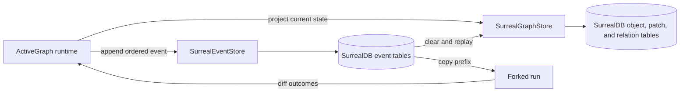

# activegraph-surrealdb

`activegraph-surrealdb` is a research-preview provider that explores using one
SurrealDB deployment for two distinct ActiveGraph responsibilities:

- an authoritative, append-ordered event log; and
- a queryable graph projection that can be erased and rebuilt from that log.

The important idea is not “put everything in one table.” It is “operate one
database without confusing the record of what happened with a disposable view
of what the world looks like now.”

> **Status: research preview.** The repository uses contract-first development.
> Passing tests are evidence for the tested versions and failure paths only;
> they are not a production-readiness, high-availability, backup, performance,
> or security certification.

## Why a reactive, event-sourced graph?

A mutable graph is excellent for questions such as “what is connected to this
record now?” It is a poor audit trail by itself: replacing an object can erase
how the system reached that answer. An event log preserves the decisions and
inputs in order, but replaying the whole log for every query is expensive.

Keeping both gives a useful recovery and experimentation loop:

1. append facts and decisions to the event log;
2. project them into a graph for current-state queries;
3. copy a run prefix to fork an alternative decision;
4. diff the two outcomes; and
5. delete and replay a projection to prove it is derived state.

See [the experiment guide](docs/experiment.md) for the executable trace and the
limits of what it proves.

## Decision matrix

| Option | Durable events | Shared graph reads | Native graph edges | Operational shape | Fit here |
| --- | --- | --- | --- | --- | --- |
| SurrealDB over WebSocket with RocksDB | Provider goal | Provider goal | Yes | One single-node deployment in the qualified lane | Chosen research path |
| PostgreSQL plus a separate graph database | Mature event-store path | Yes | In the graph service | Two databases and a synchronization boundary | Strong alternative when operational maturity matters more than consolidation |
| SQLite plus an in-process graph | Local durable events | Process-local | No shared native graph | Very small | Development and upstream reproduction |
| Embedded SurrealDB or SurrealKV | Potentially | Potentially | Yes | In-process | Not qualified by this preview |

This project does not claim that SurrealDB is a universal replacement for
PostgreSQL or a distributed graph service. It evaluates a bounded provider
contract against a pinned, repeatable configuration.

## Supported research lane

| Component | Baseline |
| --- | --- |
| ActiveGraph | `1.10.0` |
| SurrealDB server | `3.2.4` stable |
| SurrealDB Python SDK | `2.0.0` |
| Python | `3.11+` |
| Transport | remote WebSocket; local qualification uses `ws://` |
| Storage engine | server-side RocksDB |

SurrealDB `3.3.x` prereleases are a non-gating preview lane. HTTP, embedded
engines, and TLS qualification are not part of the initial evidence. Details
are in [compatibility and known issues](docs/compatibility.md).

## Architecture at a glance



The two stores may share a namespace and database, but they do not share an
ActiveGraph-owned transaction. On ActiveGraph `1.10.0`, a runtime operation can
project before its event append succeeds. Replay is the documented repair path;
the provider does **not** claim atomic event-plus-projection acceptance.

Read the full [architecture](docs/architecture.md) and [security model](docs/security-model.md).

## Appropriate use cases

- auditable agent or workflow state where alternative decisions need comparison;
- reconciliation systems that need a current graph plus an ordered evidence log;
- identity or entity-resolution experiments with reviewable forks;
- derived relationship projections that must survive process restarts; and
- evaluating SurrealDB as a consolidated operational data plane.

Do not use this preview as the sole basis for a production system that requires
distributed high availability, proven backup/restore, unqualified transports,
or atomic writes across the event and projection stores.

Application contacts, identities, credentials, source documents, and CRM data
are outside this provider's schema. An application may choose the same
SurrealDB deployment for them, but it must design its own authorization,
retention, and migration boundaries.

## Quick start

Prerequisites: Python `3.11+`, Docker with Compose, and a local port `8000`.

```bash
cp .env.example .env
# Replace both example password values in .env with the same local-only value.
set -a
. ./.env
set +a

docker compose up -d
python -m venv .venv
. .venv/bin/activate
python -m pip install -e '.[dev]'
```

Run the contract layers separately:

```bash
pytest -m 'not surrealdb and not qualification'
pytest -m surrealdb tests/integration
python examples/replay_fork_diff.py
```

The qualification suite deliberately restarts and kills the named container.
Run it only against the disposable Compose service:

```bash
ACTIVEGRAPH_SURREALDB_QUALIFY=1 pytest -m qualification tests/qualification
```

See [deployment](docs/deployment.md) and [conformance](docs/conformance.md) before
interpreting a green result.

## Project map

- `src/activegraph_surrealdb/`: provider implementation
- `tests/`: unit, live integration, qualification, and upstream-known-issue contracts
- `examples/replay_fork_diff.py`: small fork/diff/replay experiment
- `docs/adr/`: authority and version decisions
- `docs/`: architecture, operations, evidence, security, and provenance

## Contributing and security

Read [CONTRIBUTING.md](CONTRIBUTING.md) before proposing a change. Report
vulnerabilities through the private process in [SECURITY.md](SECURITY.md), not a
public issue.

## License

Copyright 2026 TrendpilotAI. Licensed under the [Apache License 2.0](LICENSE).
Dependency and trademark notes are recorded in [NOTICE](NOTICE).
