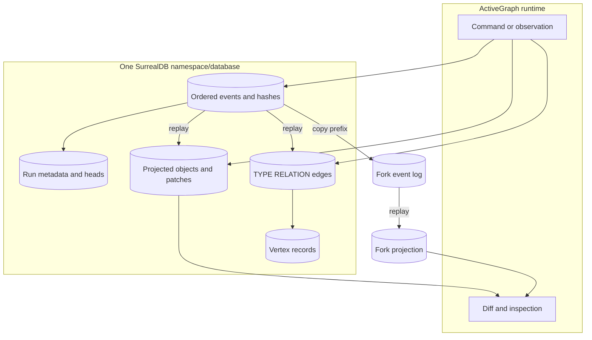

# Architecture

## The authority boundary

The event store and graph store answer different questions:

- **Event store:** What happened, in what order, and in which run?
- **Graph store:** What objects, relations, and proposed patches are visible now?

The event log is authoritative. The graph is a materialized projection. Sharing
one SurrealDB namespace/database reduces operational surface area, but it does
not merge these responsibilities or make every write atomic.

## Provider seams

`SurrealEventStore` is scoped by both `scope` and `run_id`. Its contract requires:

- monotonically ordered, gap-free sequence positions;
- run-scoped logical event uniqueness;
- a per-run head written in the same SurrealDB transaction as each append;
- stale-writer detection rather than silent rebasing;
- exact canonical JSON for replay and a hash linked to the previous event; and
- prefix truncation and copy operations that preserve the resulting head.

`SurrealGraphStore` uses the same scope/run boundary for objects, patches,
vertices, and relations. Relations are planned as native `TYPE RELATION` records
with SurrealDB `RecordID` values in `in` and `out`. Placeholder vertices allow
ActiveGraph's valid dangling-edge behavior without inventing graph objects.

Table names beginning with `ag_` are owned by the provider. Application tables
are not managed, migrated, cleared, replayed, or authorized by this package.

## Record identity

Logical identifiers can include characters that are unsafe to interpolate into
SurrealQL. The provider therefore derives opaque record keys from the record
kind, scope, run, and logical ID. Logical values remain fields for round-trip
reconstruction. Queries bind values and complete `RecordID` instances as
parameters; user-controlled table and relation names are not accepted.

The same logical event or object ID may exist in a different scope or run. A
clear, truncate, fork, or replay operation must never cross that compound
boundary.

## Live writes are not cross-store atomic

ActiveGraph `1.10.0` projects a live event before `EventStore.append()`. The two
provider stores have independent SurrealDB transaction handles, and the runtime
does not expose a transaction coordinator spanning them. Therefore:

- an event-store append is atomic with its own run head;
- a graph mutation is atomic within its own store operation; but
- the pair is not advertised as one atomic acceptance transaction.

If the second step fails, operators must treat the event log as authority and
rebuild the projection. A future runtime-owned transaction contract could
coordinate the pair, but this provider must not emulate one with undocumented
runtime internals.

## Replay lifecycle

Replay is destructive only inside the target provider scope/run projection:

1. mark the target projection incomplete;
2. clear its objects, patches, vertices, and relations;
3. apply the event history in order; and
4. mark the target ready only after the final event succeeds.

A failed replay remains failed/incomplete, and normal reads must fail closed
rather than serve a half-built graph. The contract rejects compacted logs whose
first retained event is `runtime.snapshot`; snapshot hydration and retained
horizon semantics belong to a future upstream lifecycle contract.

## Fork and diff

A fork copies an event prefix into a new run in the same scope and records its
parent run and fork event. Parent and child then accept independent suffixes.
Each run receives its own projection. ActiveGraph's diff surface can compare the
shared prefix, unique events, and divergent objects without rewriting the
parent's history.

The helper is a provider operation, not a replacement for full
`Runtime.load()`/resume. Behaviors, approvals, caches, queued work, and snapshot
state remain outside the helper's contract.
